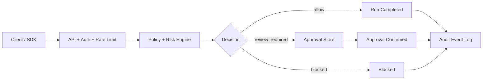

# SomaOS

[](https://github.com/TryKosm/agentic-browser-ops-platform/actions/workflows/ci.yml)
[](LICENSE)

SomaOS is a governed execution layer for AI and automation workflows. Instead of letting agents run actions unchecked, SomaOS enforces policy, routes sensitive steps through approvals, and keeps replayable audit trails for security and operations teams.

## SomaOS Governance Gateway

**What this part is.** The Governance Gateway is the public API + Python SDK slice of SomaOS. It accepts workflow actions (`actor`, `action`, `context`), returns a policy decision (`allow`, `review_required`, `blocked`) with risk score, supports approval confirmation for gated actions, and exposes run/event replay for observability.

### Quickstart

```bash
cd /path/to/agentic-browser-ops-platform
python -m venv .venv && source .venv/bin/activate
pip install -e ".[dev]"
export SOMAOS_DEMO_KEY="sk_demo_local"
uvicorn browser_ops.api:app --reload --port 8080
```

Smoke test:

```bash
curl -s -X POST "http://localhost:8080/v1/evaluate-action" \
  -H "Authorization: Bearer sk_demo_local" \
  -H "Content-Type: application/json" \
  -d '{"actor":"ops-admin","action":"export_customer_data","context":{"region":"US"}}'
```

OpenAPI is auto-published at [http://localhost:8080/docs](http://localhost:8080/docs).

### Endpoints

| Method | Path | Purpose |
|---|---|---|
| `GET`  | `/v1/health` | Liveness (no API key) |
| `POST` | `/v1/evaluate-action` | Policy + risk; may return `approval_id` |
| `POST` | `/v1/approvals/{approvalId}/confirm` | Confirm a pending approval |
| `GET`  | `/v1/runs/{runId}` | Run summary |
| `GET`  | `/v1/runs/{runId}/events` | Replayable event timeline |

Full reference and decision matrix: [docs/api.md](docs/api.md).

### Architecture



### Two realistic examples

- **Marketing workflow that needs review** — `agent:marketing-bot` calls `publish_campaign` over a 25 k-recipient PII list. The gateway returns `review_required` with an `approval_id`. A human (or downstream automation) calls `/v1/approvals/{id}/confirm` and the run completes with a clean `approval_confirmed` → `run_completed` audit pair.
- **Operations action blocked by policy** — `ops-admin` requests `disable_guardrails`. The gateway returns `blocked` immediately, the run is closed `completed`, and the event log captures `policy_evaluated` + `blocked` for postmortem.

Both flows are runnable end-to-end via [examples/client_example.py](examples/client_example.py):

```bash
python examples/client_example.py
```

### Python SDK

[`sdk/python/somaos_client.py`](sdk/python/somaos_client.py) ships a tiny client:

```python
from somaos_client import SomaOSClient

client = SomaOSClient("http://localhost:8080", api_key="sk_demo_local")
decision = client.evaluate_action("agent:checkout", "execute_browser_action", {"url": "https://stripe.com"})
if decision.approval_id:
    client.confirm_approval(decision.approval_id)
print(client.get_events(decision.run_id))
```

### API-key model

- Header: `Authorization: Bearer <SOMAOS_API_KEY>`.
- Keys map to a `workspace_id` and a `rate_limit_tier` (free/pro/enterprise).
- `401` for invalid keys, `429` once the per-minute window is exhausted, `404` for cross-workspace reads.
- V1 storage is env-backed so issuing a demo key is a one-liner; production deployments swap in a sqlite/postgres store without touching the API surface.

### Production notes

- State is currently in-memory (`approvals` + `audit`) for portability and demo speed.
- For production, swap stores to PostgreSQL/Redis while keeping the API contract stable.
- Add structured logging and request IDs before multi-instance deployment.
- Put the service behind TLS + managed secrets for API key issuance/rotation.

### Running tests

```bash
pytest -q                         # full suite
make check                        # import smoke + pytest
```

### Project standards

- Changelog: [`CHANGELOG.md`](CHANGELOG.md)
- Contributing guide: [`CONTRIBUTING.md`](CONTRIBUTING.md)
- Security policy: [`SECURITY.md`](SECURITY.md)
- License: [`LICENSE`](LICENSE)

### Local benchmark (V1, single process)

`tests/test_api.py::test_throughput_smoke` measures the `/v1/evaluate-action` round-trip over 200 sequential in-process calls (FastAPI `TestClient`). Locally this consistently lands at **120–180 req/s** — pure-Python policy engine, single worker, with full audit + approval bookkeeping in the path. Numbers are printed when the test runs with `-s`.

### Library usage (existing)

```python
from browser_ops import run
from browser_ops.models import BrowserTask

print(run(BrowserTask(url="https://example.com", goal="smoke")))
```
